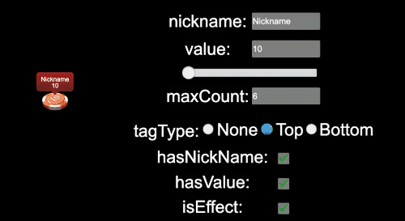

# Cocos Creator 籌碼元件

## 概述

該元件適用於 CocosCreator 2.2.3 ＋

元件內容含有籌碼落下動畫與音效以及減少的音效

---

## 範例展示

---

## 匯入組件

- 尚未匯出，稍等後續版本

---

## 元件使用說明

- 屬性

|           名稱 |            屬性             |  預設值  | 描述                             |
| -------------: | :-------------------------: | :------: | :------------------------------- |
|          value |           number            |          | 籌碼數值                         |
|       isEffect |           boolean           |  false   | 是否有動畫與音效                 |
|       nickname |           string            | Nickname | 玩家暱稱                         |
| tagHasNickname |           boolean           |   true   | 標籤是否顯示暱稱                 |
|    tagHasValue |           boolean           |   true   | 標籤是否顯示數值                 |
|       maxCount |           boolean           |    ６    | 籌碼柱最大疊數量(超過就以堆顯示) |
|     tagPostion | "NONE" \| "TOP" \| "BOTTOM" |  "TOP"   | 標籤位置(如果為"NONE"這部顯示)   |
